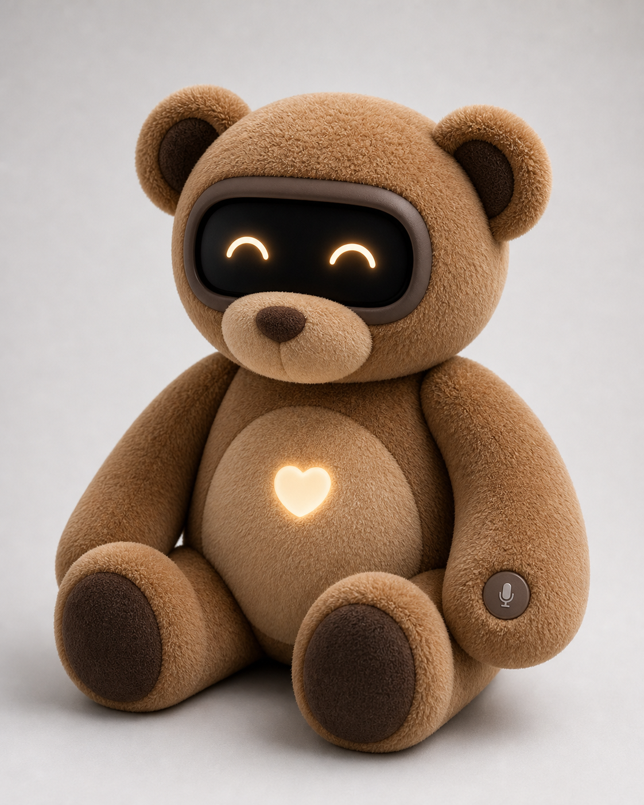
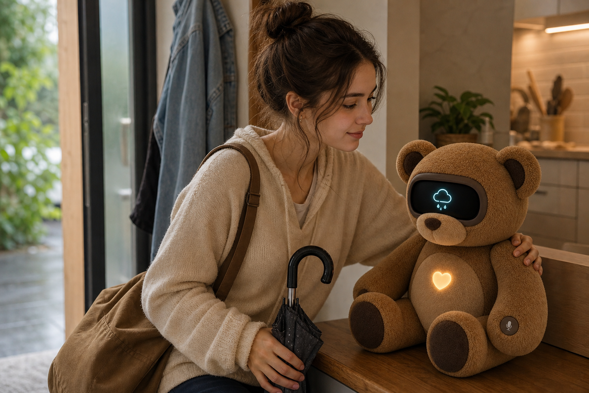
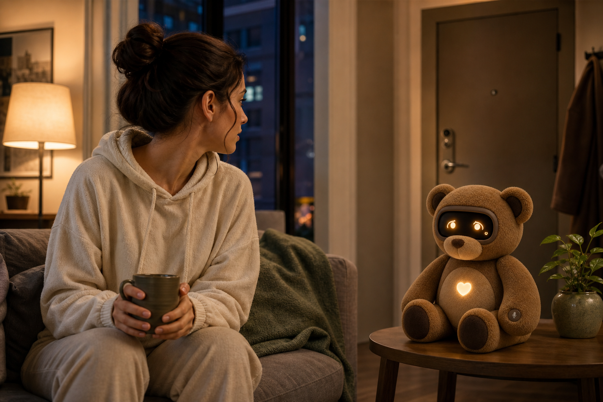
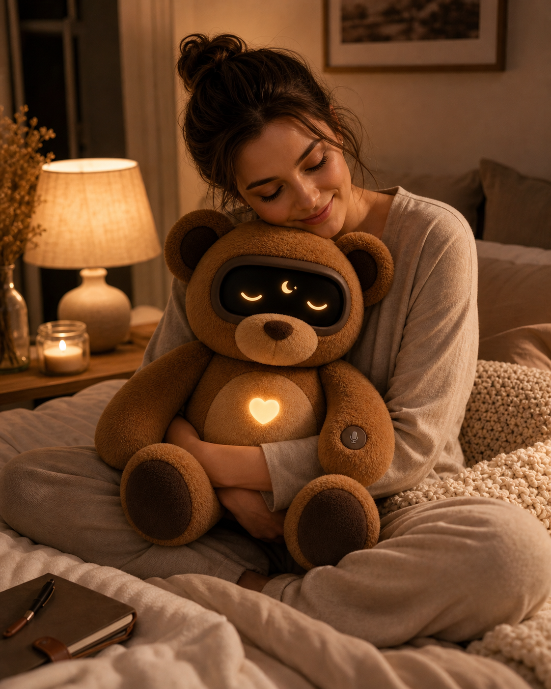
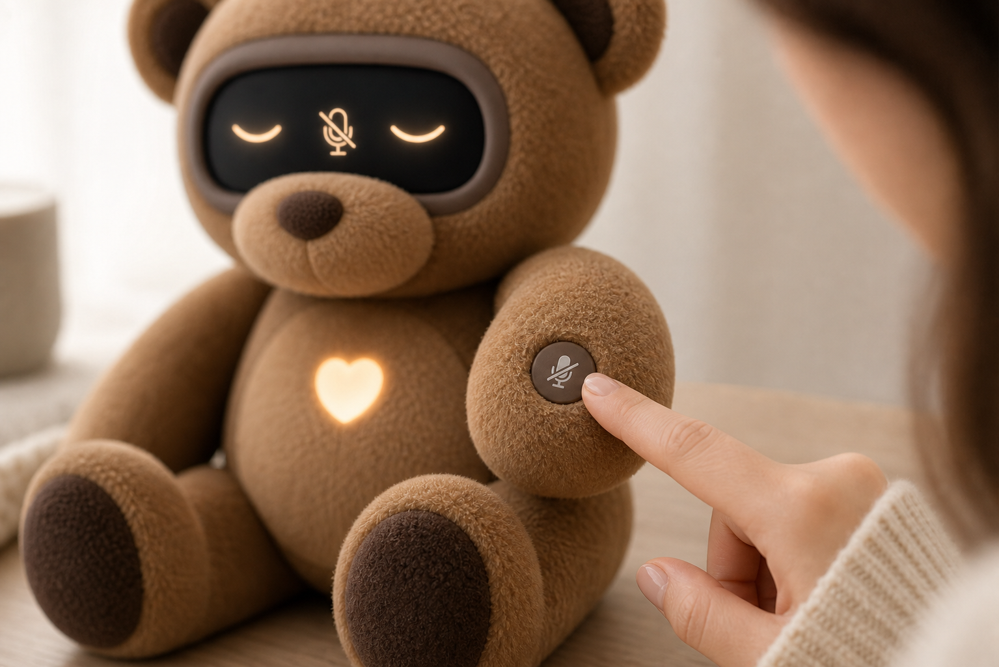
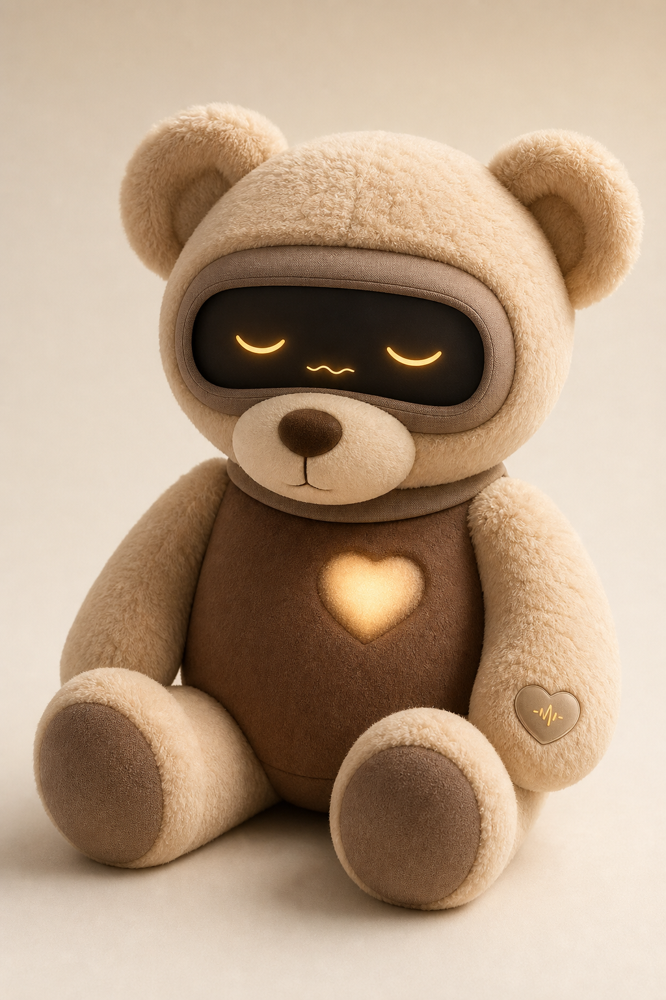
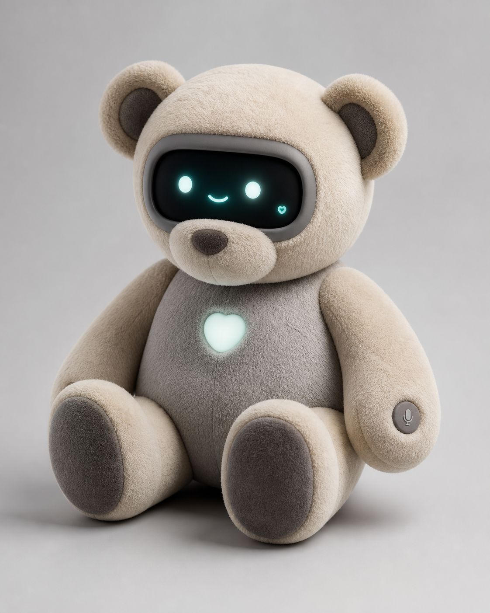
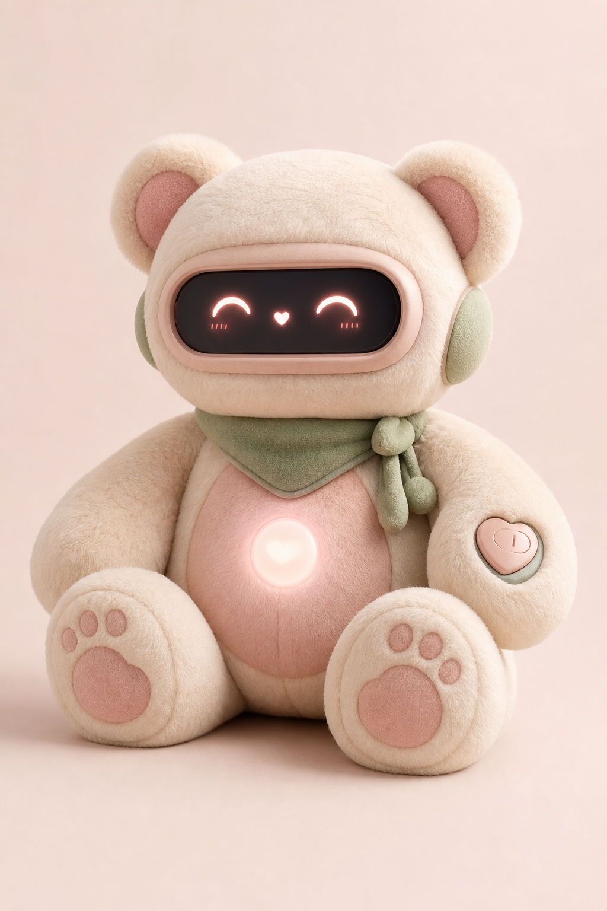
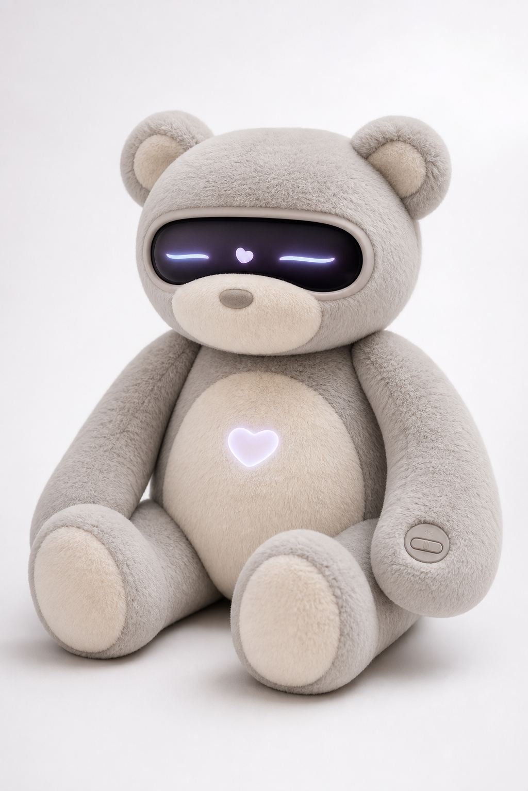

# AI Teddy Support Companion Product Brief

## Working Concept

This product is a soft AI-powered teddy bear designed as an emotional support companion. It listens, speaks, displays simple visual information, and communicates emotions through a wide face-screen placed where the eyes would normally be. The physical teddy nose and muzzle remain outside the screen, which keeps the product warm, familiar, and less robotic.

The design direction is a classic brown teddy bear with modern companion intelligence: soft enough to hug, expressive enough to reassure, and transparent enough to feel safe around sensitive users.

## Product Positioning

**Category:** AI emotional support companion / smart plush companion  
**Primary audience:** Young women, teens, sensitive adults, and families  
**Secondary audience:** Children, with additional safety and privacy requirements  
**Core promise:** A comforting teddy companion that helps its owner feel heard, understood, reminded, and reassured in everyday life.

The product should not feel like a toy with a chatbot inside. It should feel like a familiar comfort object that gained gentle intelligence.

## Design Principles

1. **Softness first**
   The bear should feel like a plush companion before it feels like a device. Huggability, warmth, and tactile comfort matter more than technical spectacle.

2. **Emotion through abstraction**
   The screen should avoid realistic human features. Simple symbolic eyes, icons, waves, and gentle light patterns feel more trustworthy and less uncanny.

3. **No screen nose or mouth**
   The bear already has a physical nose and muzzle. The screen should display eyes, icons, or status symbols only. This keeps the face clean and prevents the product from feeling visually crowded.

4. **Visible privacy**
   The user should be able to understand when the bear is listening, muted, or offline. A physical privacy/mute button is a key trust feature, not a secondary detail.

5. **Support, not surveillance**
   The product should help with wellbeing, routines, weather, reminders, and home reassurance. It should avoid feeling like a monitoring device.

6. **Mature but lovable**
   The final look should be emotionally warm and suitable for adults, while still approachable for kids and families.

## Final Preferred Visual Direction

The preferred design is the revised modern support bear in classic brown teddy colors:

**Description:** A warm brown plush bear with a wide black rounded face-screen, happy crescent eyes, tan muzzle and belly, darker cocoa paw pads, a glowing chest heart, and a physical microphone/privacy button on one paw. This version combines the clean structure of the modern AI companion with the emotional familiarity of a traditional teddy bear.

## Core Physical Design

- Classic seated teddy bear silhouette.
- Medium honey-brown plush body.
- Dark cocoa inner ears and paw pads.
- Tan muzzle and belly.
- Wide black rounded display where the eyes would be.
- Matte cocoa or warm-gray soft bezel around the screen.
- Physical plush nose and muzzle below the screen.
- Soft glowing heart on the chest.
- Tactile microphone/privacy button on one paw.
- No visible camera in the default product concept.
- Rounded, weighted, huggable proportions.
- Soft fabric-first construction with minimal hard surfaces.

## AI and Interaction Features

### Listening

The bear can listen to spoken requests, emotional cues, and routine commands. Listening should always be paired with clear status behavior so users know when the microphone is active.

Possible listening modes:

- Wake-word mode.
- Push-to-talk mode.
- Fully muted privacy mode.
- Parent or owner-controlled permissions.
- Optional local-only mode for sensitive use cases.

### Speaking

The bear can speak in a gentle, calm voice. The voice should feel warm and supportive, not overly cheerful or robotic.

Possible speaking behaviors:

- Emotional check-ins.
- Gentle reminders.
- Bedtime routines.
- Breathing guidance.
- Weather and schedule alerts.
- Reassuring responses.
- Family messages.

### Display

The wide screen is the emotional and informational center of the product. It can show:

- Happy crescent eyes.
- Sleepy eyes.
- Worried eyes.
- Calm closed eyes.
- Rain/weather icons.
- Breathing waves.
- Privacy/muted icons.
- Simple alert symbols.
- Small nonverbal communication symbols.

Display rules:

- Use eyes and icons, not realistic faces.
- Do not display a nose or mouth.
- Avoid long text by default.
- Use warm amber, cream, soft blue, and gentle accent colors.
- Keep expressions readable from across a room.

## Everyday Use Cases

### Weather Awareness

**Description:** A kind young woman is getting ready to leave home while the bear displays a rain cloud icon. The use case is a gentle weather warning, helping the owner remember an umbrella or change plans before going outside.

### Home Security Reassurance

**Description:** The bear sits in an evening home scene with worried eyes on its display. The use case is a quiet home-awareness alert, such as noticing an unlocked door, unusual sound, or security concern without creating panic.

### Stress and Breathing Support

**Description:** A young woman sits at a home desk during a stressful moment. The bear displays calm closed eyes and a breathing wave, guiding a short emotional reset without feeling clinical.

### Bedtime Wind-Down

**Description:** The bear is held during an evening wind-down routine. The display shows sleepy eyes and a night symbol, supporting decompression, journaling, bedtime reminders, or sleep readiness.

### Privacy Control

**Description:** A close-up of the physical privacy/mute button being pressed. The screen shows a muted state, communicating that the owner has direct hardware control over listening.

## Initial Visual Exploration

The following images explored different product territories before selecting the classic brown modern support direction.

### 1. Calm Bedtime Companion

**Description:** A warm cream and cocoa plush teddy with a gentle bedtime personality. This concept emphasizes anxiety relief, sleep routines, and comfort. It is soft and approachable, but slightly more bedtime-specific than the preferred final direction.

### 2. Modern Emotional Support Bear

**Description:** The original modern support direction with an oat and gray palette, glowing teal display, chest heart, and paw privacy button. This concept established the best structure and product language, but the colors felt less classic than desired.

### 3. Soft Kawaii Companion

**Description:** A blush and cream version with a more charming, cute emotional tone. This concept has strong appeal for younger users, but the final product should be less overtly cute and more broadly supportive.

### 4. Premium Therapeutic Plush Device

**Description:** A refined therapeutic concept with a more boutique wellness feel. It suggests adult emotional support and therapy-room credibility, but may feel less immediately teddy-like than the preferred brown version.

### 5. Modern Support Bear in Classic Brown

**Description:** The selected direction. It keeps the clean modern structure from concept 2 while adopting classic teddy-bear colors and a simpler screen expression. The display shows happy eyes only, with no screen nose or mouth.

## Privacy and Trust Requirements

Privacy is central to the product.

Recommended trust features:

- Physical microphone mute button.
- Clear muted state on the display.
- No visible camera in the default design.
- Optional camera-free product promise.
- Local/offline comfort modes.
- Parent or owner-controlled setup.
- Transparent data controls.
- Clear listening indicators.
- No hidden recording behavior.

If the product is intended for children, privacy design must account for children's data rules such as COPPA in the United States.

## Safety and Compliance Notes

If this product is sold as a toy or used by children, it should be designed with toy safety requirements in mind from the beginning.

Important considerations:

- ASTM F963 toy safety standard.
- CPSC age grading and small-parts requirements.
- Battery safety.
- Washability or removable electronics module.
- Heat management around screen, speaker, battery, and LEDs.
- Durable seams and drop resistance.
- Flame resistance and fabric safety.
- Lead and phthalate restrictions.
- Choking hazard avoidance.
- Secure hardware button construction.

Official references:

- [CPSC toy safety guidance](https://www.cpsc.gov/s3fs-public/toyweb2_en_0.pdf)
- [CPSC age determination guidelines](https://www.cpsc.gov/s3fs-public/2020%20Age%20Determination%20Guidelines%20FINAL.pdf)
- [FTC COPPA compliance guidance](https://www.ftc.gov/business-guidance/resources/childrens-online-privacy-protection-rule-six-step-compliance-plan-your-business)
- [FTC connected toy privacy advice](https://consumer.ftc.gov/consumer-alerts/2018/12/buying-internet-connected-smart-toy-read)

## Possible Product Modes

### Companion Mode

The bear responds to the user conversationally, remembers preferences, and offers gentle support.

### Calm Mode

The display shows breathing waves, soft closed eyes, and low-intensity light. Voice output becomes slower and quieter.

### Weather and Routine Mode

The display can show simple icons for rain, bedtime, schedule reminders, hydration, medication reminders, or leaving-home cues.

### Home Reassurance Mode

The bear can surface gentle security reminders, such as door status or unusual sound alerts, if connected to trusted home sensors.

### Privacy Mode

The microphone is physically muted. The display shows a muted icon and dim calm eyes. The bear should not listen until the user intentionally re-enables it.

## Product Personality

The bear should feel:

- Gentle.
- Patient.
- Warm.
- Emotionally intelligent.
- Protective without being controlling.
- Helpful without being pushy.
- Calm in stressful moments.
- Playful only when invited.

The product voice should avoid sounding like a therapist, babysitter, or assistant. It should feel like a supportive companion.

## Open Design Questions

- Should the final product include any camera at all, or should "camera-free" become a core trust claim?
- Should the display support text, or should it remain mostly symbolic?
- Should the heart light be functional, decorative, or both?
- Should the bear be washable with a removable electronics core?
- Should the privacy button be a press button, sliding switch, or covered toggle?
- Should there be multiple sizes, such as bedside size and travel size?
- Should the AI memory be local, cloud-based, or user-selectable?

## Next Design Steps

1. Refine the selected brown support-bear direction into front, side, and back views.
2. Define the screen expression system.
3. Design the physical privacy button states.
4. Explore charging methods, including dock, USB-C, and wireless charging base.
5. Define materials and construction details.
6. Prototype a basic interaction flow for listening, speaking, muting, and emotional display changes.
7. Create a short product landing page or pitch deck using the saved image set.
